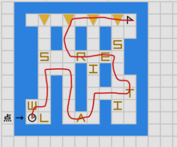

---

## 题目详情

!!! abstract ""
    *传统的走迷宫，就是把起终点连成一条线，好无趣好无聊！*

---

## 总结

??? note "题解"
   

??? example "解题代码"
    

    第二题直接跳出迷宫外即可。

    第三题要用最大的箱子上面的2格的小箱子推一下右边1格的小箱子，节省一步。

??? quote "评价"
    题目不难，比赛的时候卡坠物了，第四个尖刺想从上下绕，没想到要直走一步。跳迷宫和节省步骤还是好想到的。